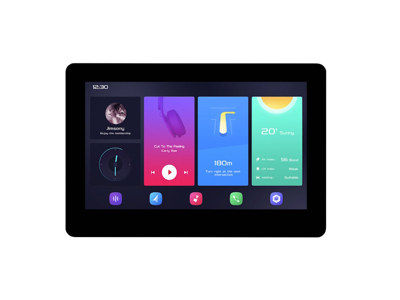
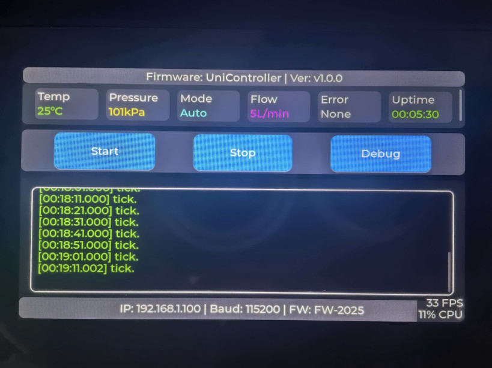

# vscode esp-idf esp32-s3 lvgl UniController example

winxos 20251212

dev board using: ESP32-S3-Touch-LCD-4.3B LVGL   https://www.waveshare.net/wiki/ESP32-S3-Touch-LCD-4.3B



Porting from official example **08_lvgl_Porting**, LVGL 8.4



This project can serve as a universal controller, with UI content configurable via an API. 

A message queue is used to decouple API calls from user interactions.

```c
void ui_init(void);
void ui_set_top_firmware_info(const char* name, const char* version);
void ui_set_status_item(int index, const char* key, const char* value, lv_color_t color);
void ui_set_button(int index, const char* text, ui_btn_callback_t callback);
void ui_add_log(const char* msg);
void ui_set_bottom_info(const char* ip, uint32_t baudrate, const char* firmware_id);
void ui_refresh_status(void);
```

You can call the APIs from other thread.

This is the main test code.

```c

#include "waveshare_rgb_lcd_port.h"
#include "ui.h"

void app_main()
{
    waveshare_esp32_s3_rgb_lcd_init(); // Initialize the Waveshare ESP32-S3 RGB LCD 
    // wavesahre_rgb_lcd_bl_on();  //Turn on the screen backlight 
    // wavesahre_rgb_lcd_bl_off(); //Turn off the screen backlight 

    vTaskDelay(pdMS_TO_TICKS(1000));

    ui_set_top_firmware_info("UniController", "v1.0.0");
    ui_set_bottom_info("192.168.1.100", 115200, "FW-2025");

    // 主状态区三列示例
    ui_set_status_item(0, "Temp", "25°C", lv_color_hex(0x00FF00));
    ui_set_status_item(1, "Pressure", "101kPa", lv_color_hex(0xFFFF00));
    ui_set_status_item(2, "Mode", "Auto", lv_color_hex(0x00FFFF));
    ui_set_status_item(3, "Flow", "5L/min", lv_color_hex(0xFF00FF));
    ui_set_status_item(4, "Error", "None", lv_color_hex(0xFFFFFF));
    ui_set_status_item(5, "Uptime", "00:05:30", lv_color_hex(0x00FF00));

    // 按钮
    ui_set_button(0, "Start", NULL);
    ui_set_button(1, "Stop", NULL);
    ui_set_button(2, "Debug", NULL);

    // 日志
    ui_add_log("System booting...");
    ui_add_log("LVGL initialized.");
    ui_add_log("Network connected.");
    ui_add_log("Device ready.");
    while(1)
    {
        ui_add_log("tick.");
        vTaskDelay(pdMS_TO_TICKS(10000));
    }
}
```

